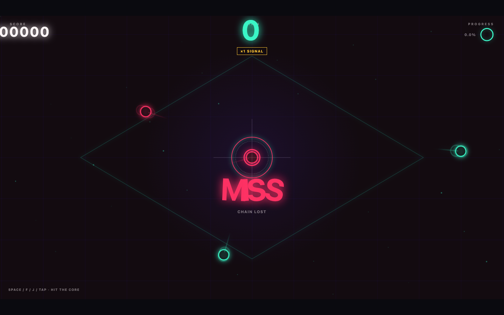

# POLYRHYTHM

A playable geometric rhythm game built as a single HTML file with anime.js v4. Neon shapes curve into the center target while Creative Commons electronic tracks drive the grid, camera, color, and scoring feedback.



## Play

Open the [live game](https://ranceheart.github.io/rhythm-game/) and press `Space` to start.

- Hit notes with `Space`, `F`, or `J`; click or tap anywhere in the playfield.
- Scroll down on the title screen to adjust volume, drag the song carousel, or rebind the main hit key.
- `PERFECT`: ±25 ms, 300 points.
- `GOOD`: ±75 ms, 200 points.
- `OK`: ±150 ms, 100 points.
- Missing a note breaks the combo.
- Multipliers increase to ×2 at 15, ×3 at 30, and ×4 at 50.

After the run, scroll down for the full timing breakdown.

## Music

The three 120-second charts use tracks by Kevin MacLeod under the [Creative Commons Attribution 4.0 license](https://creativecommons.org/licenses/by/4.0/). Note timing, animation, misses, and progress all follow the audio element's live playhead:

- [Digital Lemonade — 120 BPM, 3:00](https://incompetech.com/music/royalty-free/index.html?isrc=USUAN1700010)
- [Voltaic — 120 BPM, 3:16](https://incompetech.com/music/royalty-free/index.html?isrc=USUAN1600056)
- [EDM Detection Mode — 128 BPM, 6:06](https://incompetech.com/music/royalty-free/index.html?isrc=USUAN1500026)

## Animation showcase

Built with [anime.js v4](https://animejs.com/) using timelines, staggered motion, spring and elastic easing, SVG morphing and drawing, curved motion paths, draggable controls, scroll observers, text splitting, and WAAPI-accelerated effects.

## Local development

```bash
python3 -m http.server 8080
```

Then open <http://localhost:8080>.
